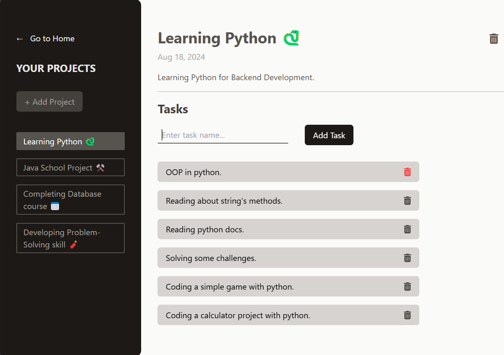

# Project Management App, with ReactJS! 

[Project Management App](https://project-management-app-og.netlify.app/). 

## Description 🪄
**An easy-to-use interface** that lets you quickly find your way around. It offers a variety of features to assist you, making it a practical **tool for gathering and organizing your ideas**, especially **when you're in a rush**.

> **Write and save what's going on in your mind, fast and easy!**

## Tools ⚙️
* ReactJS
* HTML
* JavaScript
* TailwindCSS
* PostCSS
* vite

## Guideline 🔍
* Vist the website first, [Project Management App](https://project-management-app-og.netlify.app/). 

* 

    <strong style="font-size: 1.06rem">Start by adding your first project</strong> 
    

 

* 

    <strong style="font-size: 1.06rem">Fill the form and hit the "Save" button</strong> 
    

 

* 

    <strong style="font-size: 1.06rem">You can set the `DUE DATE` by selecting a date from the calendar, by pressing the `Space button`.</strong> 
    

 

* 

    <strong style="font-size: 1.06rem">Add your project's tasks</strong> 
    

 

## Features ✨

* 

    <strong style="font-size: 1.06rem">You can **navigate** between your projects form the navbar</strong> 
    

 

* 

    <strong style="font-size: 1.06rem">You can add tasks as much as you want!</strong> 
    

 

---

Keep working on different fascinating projects, keep them organized and neat with our app. **Thanks for reading**❤️.